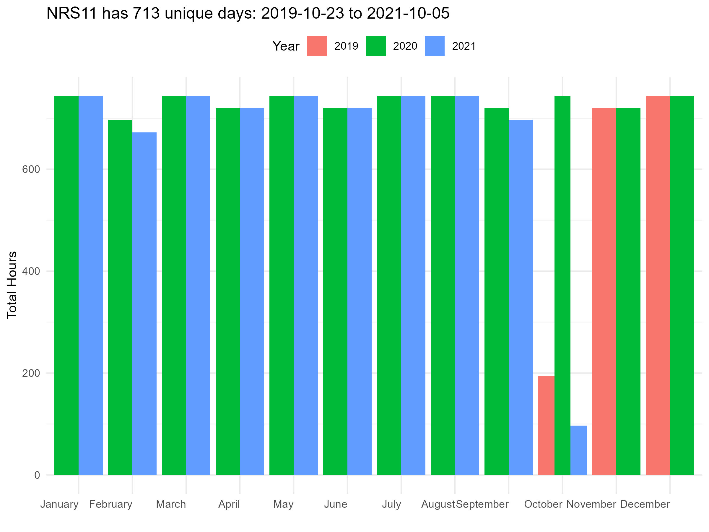
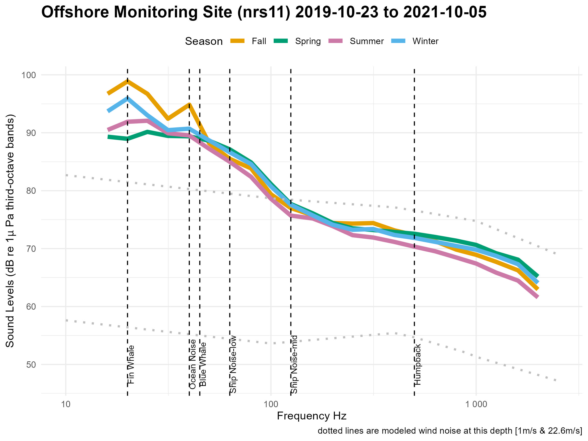

```{r, echo=FALSE, warning=FALSE, message=FALSE}
library(xlsx)
library(knitr)
library(kableExtra)

# Read Excel file (update the file path accordingly)
site = "nrs11"
inDir = "F:\\CODE\\GitHub\\SoundscapeScenes\\ONMS-Sound\\context\\"
metaFile = paste0(inDir,"ONMSSound_IndicatorCategories.xlsx")
lookup = as.data.frame ( read.xlsx(metaFile, sheetIndex = 1) )
colnames(lookup) = lookup[1, ]         # Set first row as column names
lookup = as.data.frame( lookup[-1, ] ) # Remove the first row
lookup = as.data.frame( lookup[!apply(lookup, 1, function(row) all(is.na(row))), ] )
siteInfo = lookup[lookup$`NCEI ID` == site,]
siteInfo = siteInfo[!is.na(siteInfo$`NCEI ID`), ]

siteDetails = as.data.frame ( read.xlsx(metaFile, sheetIndex = "CB") )
siteDetails = siteDetails[rowSums(is.na(siteDetails)) != ncol(siteDetails), ]
siteDetails = siteDetails[rowSums(is.na(siteDetails)) != ncol(siteDetails), ]
siteDetails <- siteDetails[, colSums(is.na(siteDetails)) != nrow(siteDetails)]

```

# **What is ocean sound?**

Ocean sound refers to the collection of acoustic energy present in
marine environments, encompassing a variety of sources, including sounds
from marine animals, geophysical noise from waves, wind, rain, and human
generated noise from shipping, sonar, and offshore construction. This
collection of sound at a given place and time is often call a
soundscape. Monitoring ocean soundscapes provides key insight to
understanding ecosystem dynamics, detecting environmental changes, and
managing the impacts of noise pollution on marine organisms. Learn more
at [Discovery of Sound in the Sea](https://dosits.org/)

**Why do we care?** Ocean sound is critical for the survival of many
marine animals because it is a primary means of communication,
orientation and navigation, finding food, avoiding predators, and
choosing mates. As such, human activities that produce underwater sounds
have the potential to negatively impact animals by reducing their
ability to hear prey, predators, and each other. National marine
sanctuaries are home to many acoustically active marine animals and
understanding the presence and impacts of noise is a conservation
priority. Further, the occurrence and types of sounds present offer key
insights on animal presence, species behaviors, human-use patterns, and
changing ocean conditions.

# **When, where, & why are we listening?**

NOAA's Office of National Marine Sanctuaries maintains a nationally
coordinated underwater sound monitoring network across the National
Marine Sanctuary System, known as ONMS Sound. ONMS works with partners
to monitor [sound within national marine
sanctuaries](https://sanctuaries.noaa.gov/science/monitoring/sound/).
Ocean Sound monitoring sites are located in strategic locations within
sanctuary boundaries and record continuously. Audio recordings and
standardized sound measurements are available through the NOAA National
Centers for Environmental Information's Passive Acoustic Archive.
Explore the monitoring sites
[here](https://www.ncei.noaa.gov/maps/passive-acoustic-data/).

The **`r params$author`** (`r params$abrv`) is entirely offshore. Within
its 1,286 square miles, the sanctuary protects soft seafloor habitat, a
rocky bank, deep sea canyons, and communities of wildlife throughout.
Its surface waters are feeding areas for local and migratory seabirds
and marine mammals.

**Ocean sound monitoring** in this sanctuary began in 2014, as part of
the [**Ocean Noise Reference
Station**](https://www.pmel.noaa.gov/acoustics/noaanps-ocean-noise-reference-station-network).
This unique network of hydrophones is a collaborative effort between
Pacific Marine Environmental Laboratory, all NMFS Science Centers, the
NOS National Marine Sanctuary System, and the National Park Service to
establish and collect consistent and comparable long-term acoustic data
sets covering all major regions of the U.S. The primary objective of the
this network is to [monitoring trends in Ocean
Noise](https://www.sciencedirect.com/science/article/pii/S0308597X17306309),
a critical aspect of NOAA's mandate for ocean and coastal stewardship.

```{r, echo=FALSE, warning=FALSE, message=FALSE, out.width="25%", out.height="25%"}
siteDetails %>% 
  kable("html") %>% 
  kable_styling(full_width = FALSE) %>% 
  scroll_box(width = "100%", height = "400px")
```

# **Summary of Monitoring Effort**

```{r, echo=FALSE, warning=FALSE, fig.show="hold", message = FALSE}


```

# **What sounds contribute to the soundscape?**

```{r, echo=FALSE, warning=FALSE, message = FALSE, fig.cap=paste("**A visualization of ocean sound in", params$sitetyp, "habitat**. Seasonal summary of measured sound levels (colored lines) shown as median hourly values over all available data. Vertical lines indicate representative frequencies for different sound sources: ship noise (63, 125 Hz), fin whales (20 Hz), blue whales (45 Hz), and humpback whales (500 Hz). The bottom bar shows how the data are distributed in the different wind categories: low < 5 m/s, med 5-10 m/s, high >10 m/s. Dotted lines are modeled wind noise at this depth based on [Hildebrand et al 2021](https://www.google.com/url?q=https://pubs.aip.org/asa/jasa/article/149/6/4516/1059383&sa=D&source=docs&ust=1739833923518127&usg=AOvVaw24yaJ1b4fPnOnoYFke3nuD)." )}
library(knitr)

# Load and display an image with a caption


```

<button onclick="document.getElementById(&#39;infoModal&#39;).showModal()">

How was this calculated?

</button>

<dialog id="infoModal">

<p>The median power spectral densities (PSD) for all hours across all
years are calculated from calibrated audio data using community software
tools:
<a href="https://github.com/MarineBioAcousticsRC/Triton/tree/master" target="_blank">Triton
Soundscape Metrics</a>,
<a href="https://pubs.aip.org/asa/jel/article/1/1/011203/219719" target="_blank">MANTA</a>,
or
<a href="https://github.com/lifewatch/pypam" target="_blank">PyPAM</a>.
Triton software calculates the one-third octave band sound pressure
levels by integration of PSD levels with a 1 Hz/1 second resolution and
a median was used to calculate hourly values over no less than 1,800 1-s
values for that hour and converted to decibels (dB re 1 μPa). MANTA and
PYPAM software calculates power spectral density (PSD) levels per minute
(μPa²) within the hybrid milledecade frequency bands.
<a href="https://cran.r-project.org/web/packages/PAMscapes/index.html" target="_blank">PAMscapes</a>
was used to calculate the median for each hour within one-third octave
bands. These values were then converted to 1-Hz resolution to match the
wind model results by converting to pressure and dividing by the band
width before converting back to sound spectrum levels in decibels (dB re
1 μPa/Hz).</p>

<button onclick="document.getElementById('infoModal').close()">Close</button>
</dialog>

<div style="width: 100%; height: 300px; overflow-x: scroll; white-space: nowrap;">

<figure style="display: inline-block; margin-right: 10px;">


<figcaption>Figure 1: Caption for Image 1</figcaption>

</figure>

<figure style="display: inline-block; margin-right: 10px;">


<figcaption>Figure 2: Caption for Image 2</figcaption>

</figure>
