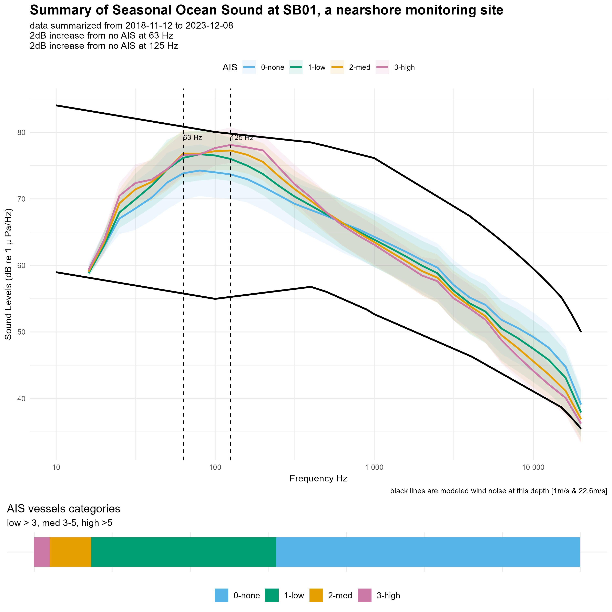
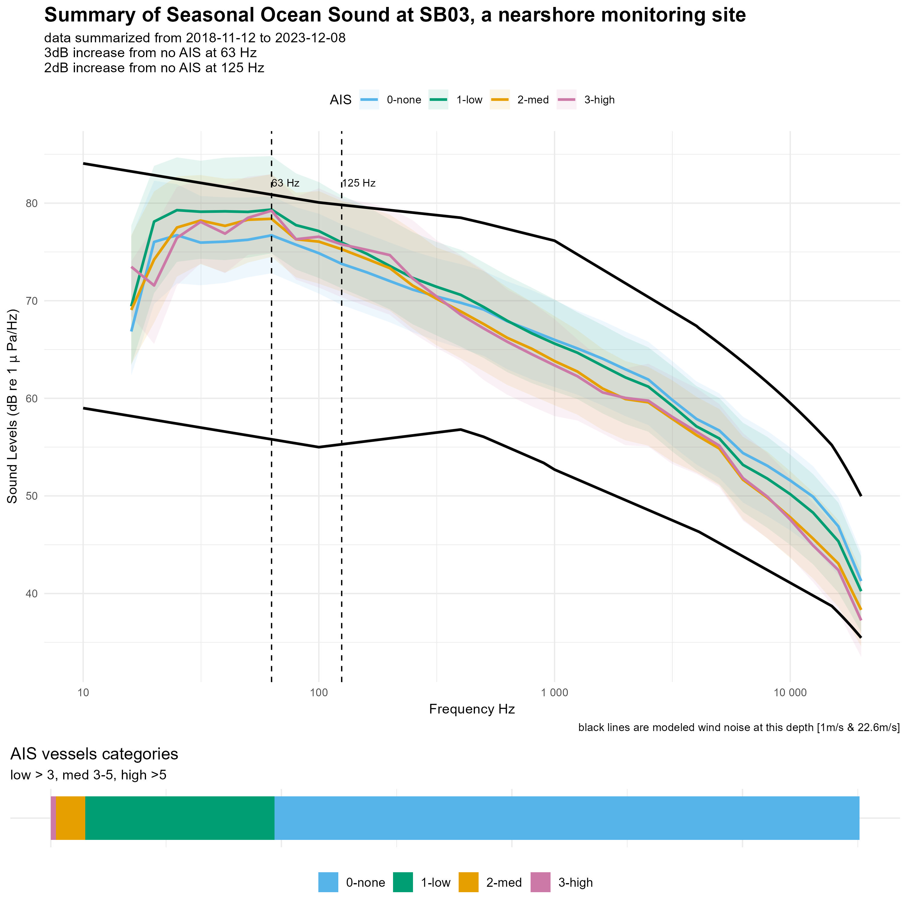

```{r, echo=FALSE, warning=FALSE, message=FALSE}
library(xlsx)
library(knitr)
library(kableExtra)

# Read Excel file (update the file path accordingly)
site = c("sb01","sb03")
inDir = "F:\\CODE\\GitHub\\SoundscapeScenes\\ONMS-Sound\\context\\"
metaFile = paste0(inDir,"ONMSSound_IndicatorCategories.xlsx")
lookup = as.data.frame ( read.xlsx(metaFile, sheetIndex = 1) )
colnames(lookup) = lookup[1, ]         # Set first row as column names
lookup = as.data.frame( lookup[-1, ] ) # Remove the first row
lookup = as.data.frame( lookup[!apply(lookup, 1, function(row) all(is.na(row))), ] )
siteInfo = lookup[lookup$`NCEI ID` == site,]
siteInfo = siteInfo[!is.na(siteInfo$`NCEI ID`), ]

siteDetails = as.data.frame ( read.xlsx(metaFile, sheetIndex = "SB") )
siteDetails = siteDetails[rowSums(is.na(siteDetails)) != ncol(siteDetails), ]
siteDetails = siteDetails[rowSums(is.na(siteDetails)) != ncol(siteDetails), ]
siteDetails <- siteDetails[, colSums(is.na(siteDetails)) != nrow(siteDetails)]
```
::: {style="border: 1px solid black; padding: 10px; margin-bottom: 20px;"}
# **What is ocean sound?**

Ocean sound refers to the collection of acoustic energy present in marine environments, encompassing a variety of sources, including sounds from marine animals, geophysical noise from waves, wind, rain, and human generated noise from shipping, sonar, and offshore construction. This collection of sound at a given place and time is often called a soundscape. Monitoring ocean soundscapes provides key insight to understanding ecosystem dynamics, detecting environmental changes, and managing the impacts of noise pollution on marine organisms. Learn more about ocean sounds at [Discovery of Sound in the Sea](https://dosits.org/).

**Why do we care?** Ocean sound is critical for the survival of many marine animals because it is a primary means of communication, orientation and navigation, finding food, avoiding predators, and choosing mates. As such, human activities that produce underwater sounds have the potential to negatively impact animals by reducing their ability to hear prey, predators, and each other. **US National marine sanctuaries** are home to many acoustically active marine animals and understanding the presence and impacts of noise is a conservation priority. Further, the occurrence and types of sounds present offer key insights on animal presence, species behaviors, human-use patterns, and changing ocean conditions.
:::

::: {style="border: 1px solid black; padding: 10px; margin-bottom: 20px;"}
# **When, where, & why are we listening?**

NOAA's Office of National Marine Sanctuaries (ONMS) maintains a nationally coordinated underwater sound monitoring network across the National Marine Sanctuary System, known as [ONMS Sound](https://sanctuaries.noaa.gov/science/monitoring/sound/). ONMS sound works with partners to monitor off the US East Coast, in the Gulf of Mexico, off the West Coast and in the Pacific Islands region. Ocean Sound monitoring sites are located in strategic locations within sanctuary boundaries and records continuously. Audio recordings and standardized sound measurements are available through the NOAA National Centers for Environmental Information's Passive Acoustic Archive. Explore the acoustic monitoring sites [here](https://www.ncei.noaa.gov/maps/passive-acoustic-data/).

The **`r params$author`** is one of the largest marine protected areas in the United States, spanning over 6,094 square miles along the central California coast. It is home to a rich diversity of marine life, including whales, sea otters, seabirds, and vast kelp forests. MBNMS supports these ecosystems, promotes marine research, and offers many ocean-based recreational opportunities like diving, fishing, and whale watching.

**Ocean sound monitoring** coordinated by ONMS began in 2019, however, a long history of underwater acoustic monitoring has occurred in this sanctuary [[1](https://pubs.aip.org/asa/arlo/article/3/2/65/123823/Ocean-ambient-sound-Comparing-the-1960s-with-the)]. Further, the Monterey Bay Aquarium Research Institute supports a continuous real-time monitoring effort within the sanctuary that began in 2015, known as the [Soundscape Listening Room](https://www.mbari.org/project/soundscape-listening-room/). Collectively, these underwater sound monitoring efforts have provided key insight on [cryptic species](https://movementecologyjournal.biomedcentral.com/articles/10.1186/s40462-024-00500-x) , [whale migration patterns and drivers](https://besjournals.onlinelibrary.wiley.com/doi/10.1111/1365-2435.14013), [methods for detecting fish sounds](https://pubs.aip.org/asa/jasa/article/153/3/1710/2881267) , and the [steady rise in ocean noise levels](https://pubs.aip.org/asa/arlo/article/3/2/65/123823/Ocean-ambient-sound-Comparing-the-1960s-with-the), to highlight a few.

**Current ocean sound monitoring and analysis** is maintained at four sites within MBNMS. Two sites (MB01, MB02) are located more inshore, capturing more local vessel activity and sounds from nearshore species. The two offshore sites (MB03, MBARI_MARS) capture patterns in migrating whales and transiting commercial vessel traffic.

**Summary of ocean sound monitoring sites**
```{r, echo=FALSE, warning=FALSE, message=FALSE, out.width="25%", out.height="25%"}
siteDetails %>% 
  kable("html") %>% 
  kable_styling(full_width = FALSE) %>% 
  scroll_box(width = "100%", height = "400px")
```
::: 

::: {style="border: 1px solid black; padding: 10px; margin-bottom: 20px;"}
# **What is a soundscape?**
Soundscapes are complex -- representing all the types of sounds present at a given time and location and influenced by the weather. **How do we visualize this information?** To orient you to the different contributions to a soundscape, in the figure below the colored lines represent seasonal differences, vertical lines indicate different sound sources of interest and what frequency(s) represents the source, and the black lines bound the soundscape to expected range at this location, when only wind noise is present. We can track these different features over time to understand how soundscape components are changing, and compare conditions across sites.

```{r, echo=FALSE, warning=FALSE, message = FALSE, fig.cap=paste("**A visualization of ocean sound in", params$sitetyp, "habitat**. Seasonal summary of measured sound levels (colored lines) shown as median hourly values over all available data. Vertical lines indicate representative frequencies for different sound sources: ship noise (63, 125 Hz), fin whales (20 Hz), blue whales (45 Hz), and humpback whales (500 Hz). The bottom bar shows how the data are distributed in the different wind categories: low < 5 m/s, med 5-10 m/s, high >10 m/s. Dotted lines are modeled wind noise at this depth based on [Hildebrand et al 2021](https://www.google.com/url?q=https://pubs.aip.org/asa/jasa/article/149/6/4516/1059383&sa=D&source=docs&ust=1739833923518127&usg=AOvVaw24yaJ1b4fPnOnoYFke3nuD)." )}
knitr::include_graphics(("plot_sb01_SeasonalSPL.jpg") )
knitr::include_graphics(("plot_sb03_SeasonalSPL.jpg") )
```

<button onclick="document.getElementById(&#39;infoModal&#39;).showModal()">
How was this calculated?
</button>
<dialog id="infoModal">
<p>The median power spectral densities (PSD) for all hours across all years are calculated from calibrated audio data using community software tools: <a href="https://github.com/MarineBioAcousticsRC/Triton/tree/master" target="_blank">Triton Soundscape Metrics</a>, <a href="https://pubs.aip.org/asa/jel/article/1/1/011203/219719" target="_blank">MANTA</a>, or <a href="https://github.com/lifewatch/pypam" target="_blank">PyPAM</a>. Triton software calculates the one-third octave band sound pressure levels by integration of PSD levels with a 1 Hz/1 second resolution and a median was used to calculate hourly values over no less than 1,800 1-s values for that hour and converted to decibels (dB re 1 μPa). MANTA and PYPAM software calculates power spectral density (PSD) levels per minute (μPa²) within the hybrid milledecade frequency bands. <a href="https://cran.r-project.org/web/packages/PAMscapes/index.html" target="_blank">PAMscapes</a> was used to calculate the median for each hour within one-third octave bands. These values were then converted to 1-Hz resolution to match the wind model results by converting to pressure and dividing by the band width before converting back to sound spectrum levels in decibels (dB re 1 μPa/Hz).</p>
<button onclick="document.getElementById('infoModal').close()">Close</button> </dialog>

<button onclick="document.getElementById(&#39;infoModal2&#39;).showModal()">
How does my sanctuary compare?
</button>
<dialog id="infoModal2">
<p>No one soundscape is alike and we can use other sites in similar oceanographic settings (e.g. nearshore or offshore) to compare conditions. From 2018-2022, the U.S. National Oceanic and Atmospheric Administration (NOAA) and the U.S. Navy engaged in a multi-year effort to monitor underwater sound within the U.S. National Marine Sanctuary System, known as <a href="https://sanctuaries.noaa.gov/science/monitoring/sound/sanctsound.html" target="_blank">Sanctuary SoundScape Monitoring Project</a>. Data collected during this dedicated period provide <a href="https://www.frontiersin.org/journals/marine-science/articles/10.3389/fmars.2021.719258/full" target="_blank">initial insights</a> on how soundscapes compare.</p>

```{r, echo=FALSE, warning=FALSE, message=FALSE, fig.cap=paste("**A visualization of ocean sound compared across other ONMS nearshore sites**. Ocean sound data and analysis are part of the [Sanctuary Soundcape Monitoring Project](https://sanctsound.ioos.us/) and summarized in publication on [Advance the interpretation of shallow water marine soundscapes](https://www.frontiersin.org/journals/marine-science/articles/10.3389/fmars.2021.719258/full)" )}
# Load and display an image with a caption
knitr::include_graphics(("plot_sb01_Compare.jpg"))
knitr::include_graphics(("plot_sb03_Compare.jpg"))
```
<button onclick="document.getElementById('infoModal2').close()">Close</button> </dialog>
:::

::: {style="border: 1px solid black; padding: 10px; margin-bottom: 20px;"}
# **What are the latest conditions in ocean sound?**
Soundscapes are dynamic, changing with season and annual differences in sources (wind, biologics, and human-activity). Efforts to reduce noise are underway on global to local scales though [vessel speed reduction strategies and engineering solutions](https://pubs.aip.org/asa/jasa/article/156/5/3534/3321836). Measuring annual trends in ocean noise provide insights on trends in ocean noise: Are levels lower in the most recent year of monitoring?
```{r, echo=FALSE, warning=FALSE, message=FALSE, fig.cap=paste("**Annual difference in Ocean Sound**" ) }
knitr::include_graphics(("plot_sb01_YearSPL.jpg"))
knitr::include_graphics(("plot_sb03_YearSPL.jpg"))
```
:::

::: {style="border: 1px solid black; padding: 10px; margin-bottom: 20px;"}
# **How often is ship noise above threshold?**
In many nearshore marine environments, vessels are transiting the region for a variety of reasons and [adding noise to the soundscape](https://link.springer.com/article/10.1007/s10661-024-12497-2). Using 100 Hz as an indicator of vessel noise, we measured how often vessel noise is above sound levels at the known wind conditions. This method helps to control for the influence of wind on a soundscape. Specifically, when wind is high, vessel noise exceedance will be lower, compared to lower wind speed conditions.
```{r, echo=FALSE, warning=FALSE, message=FALSE, fig.cap=paste("**Noise Exceedance**" ) }
knitr::include_graphics(("plot_sb01_Exceed100.jpg"))
knitr::include_graphics(("plot_sb03_Exceed100.jpg"))
```
:::

::: {style="border: 1px solid black; padding: 10px; margin-bottom: 20px;"}
# **How much noise do AIS vessels contribute to the soundscape?**
We can segment the ocean sound data into times when vessels transmitting AIS are present and times when not present. Segmenting the soundscape into vessel and non-vessel periods provides insight on how vessels contribute to the soundscape. In this example, we calculate how many dB vessel noise periods are above non-vessel noise periods. AIS Vessels are considered present if with 10 km of the monitoring location.
```{r, echo=FALSE, warning=FALSE, message=FALSE, fig.cap=paste("**AIS vessel Noise**" ) }
knitr::include_graphics(("plot_sb01_AISNoise.jpg"))
knitr::include_graphics(("plot_sb03_AISNoise.jpg"))
```
:::

<div style="border: 1px solid black; padding: 10px; margin-bottom: 20px;">
<h1 style="text-align: center;">How much noise do AIS vessels contribute to the soundscape?</h1>
<p>We can segment the ocean sound data into times when vessels transmitting AIS are present and times when not present. Segmenting the soundscape into vessel and non-vessel periods provides insight on how vessels contribute to the soundscape. In this example, we calculate how many dB vessel noise periods are above non-vessel noise periods. AIS Vessels are considered present if within 10 km of the monitoring location.</p>


<div style="width: 100%; height: 900px; overflow-x: scroll; white-space: nowrap;">

<figure style="display: inline-block; margin-right: 10px; border: 2px solid black; padding: 5px;">

<figcaption> SB01: Soundscape comparison when vessels present </figcaption>
</figure>

<figure style="display: inline-block; margin-right: 10px; border: 2px solid black; padding: 5px;">

<figcaption> SB03: Soundscape comparison when vessels present </figcaption>
</figure>

</div>
</div>

::: {style="border: 1px solid black; padding: 10px; margin-bottom: 20px;"}
# **What are we learning?**
Coming soon...
:::
