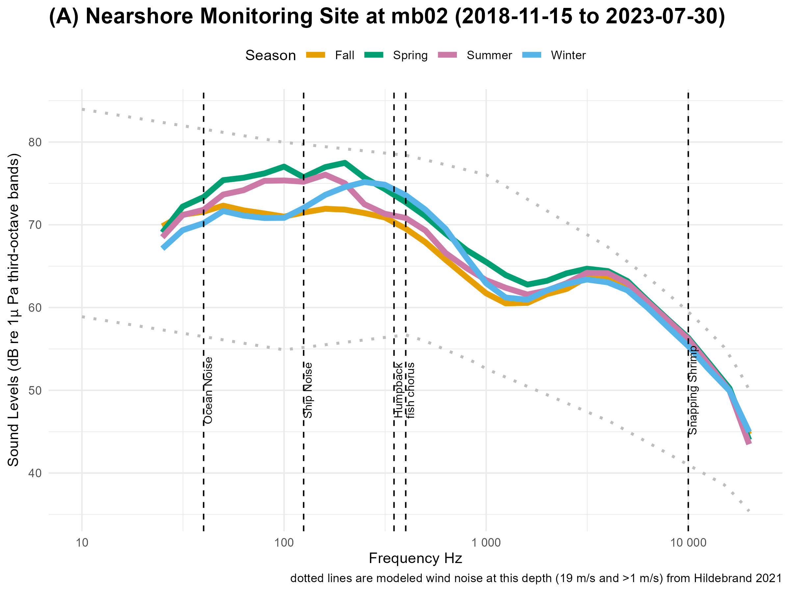
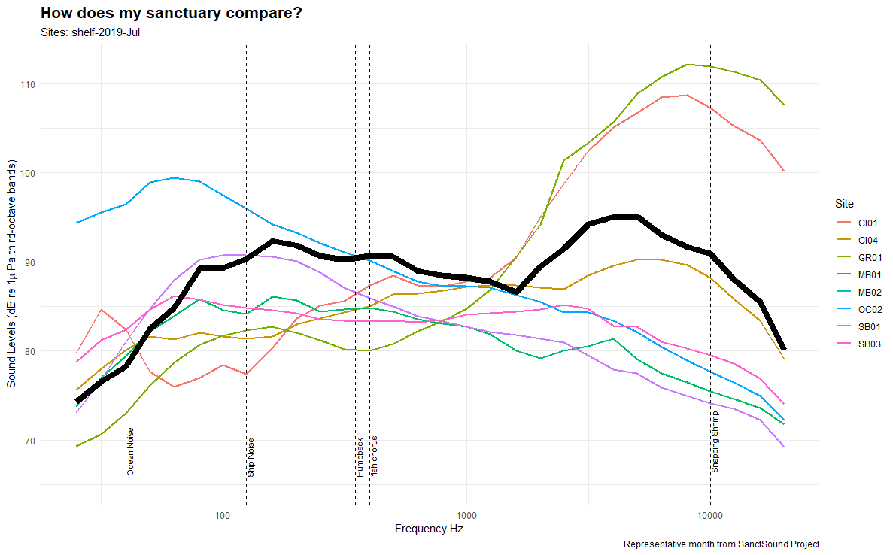
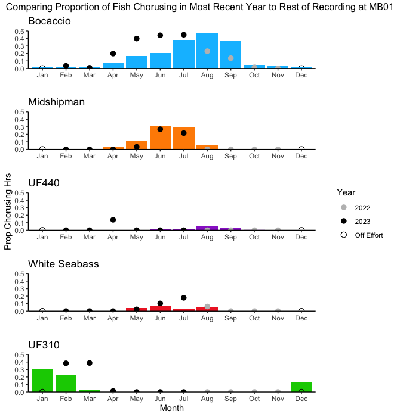
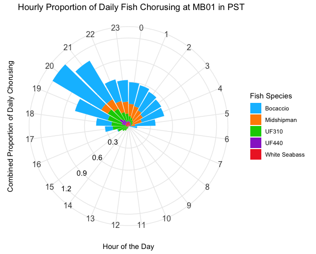

```{r, echo=FALSE, warning=FALSE, message=FALSE}
library(xlsx)
library(knitr)
library(kableExtra)

# Read Excel file (update the file path accordingly)
site = "mb01"
inDir = "F:\\CODE\\GitHub\\SoundscapeScenes\\ONMS-Sound\\context\\"
metaFile = paste0(inDir,"ONMSSound_IndicatorCategories.xlsx")
lookup = as.data.frame ( read.xlsx(metaFile, sheetIndex = 1) )
colnames(lookup) = lookup[1, ]         # Set first row as column names
lookup = as.data.frame( lookup[-1, ] ) # Remove the first row
lookup = as.data.frame( lookup[!apply(lookup, 1, function(row) all(is.na(row))), ] )
siteInfo = lookup[lookup$`NCEI ID` == site,]
siteInfo = siteInfo[!is.na(siteInfo$`NCEI ID`), ]

siteDetails = as.data.frame ( read.xlsx(metaFile, sheetIndex = 6) )
siteDetails = siteDetails[rowSums(is.na(siteDetails)) != ncol(siteDetails), ]
```

# **What is ocean sound?**
Ocean sound refers to the collection of acoustic energy present in marine environments, encompassing a variety of sources, including sounds from marine animals, geophysical noise from waves, wind, rain, and human generated noise from shipping, sonar, and offshore construction. Monitoring ocean sound provides key insight to understanding ecosystem dynamics, detecting environmental changes, and managing the impacts of noise pollution on marine organisms. Learn more at [Discovery of Sound in the Sea](https://dosits.org/)

**Why do we care?** Ocean sound is critical for the survival of many marine animals because it is a primary means of communication, orientation and navigation, finding food, avoiding predators, and choosing mates. As such, human activities that produce underwater sounds have the potential to negatively impact animals by reducing their ability to hear prey, predators, and each other.  

National marine sanctuaries are home to many acoustically active marine animals and understanding the presence and impacts of noise is a conservation priority. Further, the occurrence and types of sounds present offer key insights on animal presence, species behaviors, human-use patterns, and changing ocean conditions. 

# **When, where, and why are we listening?**

NOAA’s Office of National Marine Sanctuaries maintains a nationally coordinated underwater sound monitoring network across the National Marine Sanctuary System, known as ONMS Sound. ONMS works with partners to monitor [sound within national marine sanctuaries](https://sanctuaries.noaa.gov/science/monitoring/sound/) off the US East Coast, in the Gulf of Mexico, off the West Coast and in the Pacific Islands region. Ocean Sound monitoring sites are located in strategic locations within sanctuary boundaries and records continuously. Audio recordings and standardized sound measurements are available through the  NOAA National Centers for Environmental Information’s Passive Acoustic Archive. Explore the monitoring sites [here](https://www.ncei.noaa.gov/maps/passive-acoustic-data/).

The **`r params$author`** is one of the largest marine protected areas in the United States, spanning over 6,094 square miles along the central California coast. It is home to a rich diversity of marine life, including whales, sea otters, seabirds, and vast kelp forests. MBNMS supports these ecosystems, promotes marine research, and offers many ocean-based recreational opportunities like diving, fishing, and whale watching. 

**Ocean sound monitoring** supported by ONMS began in 2019, however, a long history of underwater acoustic monitoring has occurred in this sanctuary[1](https://pubs.aip.org/asa/arlo/article/3/2/65/123823/Ocean-ambient-sound-Comparing-the-1960s-with-the). Further, the Monterey Bay Aquarium Research Institute supports a continuous real-time monitoring effort within the sanctuary that began in 2015, known as the  [Soundscape Listening Room](https://www.mbari.org/project/soundscape-listening-room/). Collectively, these underwater sound monitoring efforts have provided key insight on [cryptic species](https://movementecologyjournal.biomedcentral.com/articles/10.1186/s40462-024-00500-x) ,  [whale migration patterns and drivers](https://besjournals.onlinelibrary.wiley.com/doi/10.1111/1365-2435.14013),  [methods for detecting fish sounds](https://pubs.aip.org/asa/jasa/article/153/3/1710/2881267) , and the [steady rise in ocean noise levels](https://pubs.aip.org/asa/arlo/article/3/2/65/123823/Ocean-ambient-sound-Comparing-the-1960s-with-the), to highlight a few.

**Current ocean sound monitoring and analysis** is maintained at four sites within MBNMS. Two sites (MB03, MBARI_MARS) are located further offshore, capturing patterns in migrating whales and transiting commercial vessel traffic. The two other sites (MB01, MB02) are located more inshore, capturing more local vessel activity and sounds from nearshore species.

```{r, echo=FALSE, warning=FALSE, message=FALSE}
# Print table with text wrapping
siteDetails %>% 
  kable("html") %>% 
  kable_styling(full_width = FALSE) %>% 
  scroll_box(width = "100%", height = "400px")
```

# **What sounds contribute to the soundscape?**
```{r, echo=FALSE, warning=FALSE, message=FALSE}
library(knitr)

# Load and display an image with a caption

```
**Figure 1.1: A visualization of ocean sound in neashore habitat**. Seasonal summary of measured sound levels (colored lines) shown as median hourly values over all available data. Vertical lines indicate representative frequencies for different sound sources: ship noise-nearshore (125 Hz), humpback whales (500 Hz), fish chorus (400 Hz) and snapping shrimp (10,000 Hz). The bottom bar  shows how the data are distributed in the different wind categories: low < 5 m/s, med 5-10 m/s, high >10 m/s. Dotted lines are modeled wind noise at this depth based on [Hildebrand et al 2021](https://www.google.com/url?q=https://pubs.aip.org/asa/jasa/article/149/6/4516/1059383&sa=D&source=docs&ust=1739833923518127&usg=AOvVaw24yaJ1b4fPnOnoYFke3nuD) (upper bound are for winds 19-22 m/s and lower bound are for winds <1 m/s) 

<button onclick = "alert('The median PSD for all hours for all years are shown for each of the available one-third octave frequency bands. To calculate these values, audio data were calibrated and processed into sound levels measurements using either Triton Soundscape Metrics, MANTA (Ref) or PyPAM software options.')">
  How was this calculated?
</button> 

# How does my sanctuary compare?
```{r, echo=FALSE, warning=FALSE, message=FALSE}
library(knitr)

# Load and display an image with a caption

```
**Figure 1.2: A visualization of ocean sound compared across other ONMS nearshore sites**. Ocean sound data and analysis are part of the [Sanctuary Soundcape Monitoring Project](https://sanctsound.ioos.us/) and summarized in publication on [Advance the interpretation of shallow water marine soundscapes](https://www.frontiersin.org/journals/marine-science/articles/10.3389/fmars.2021.719258/full)

<button onclick = "alert('The median PSD for all hours for all years are shown for each of the available one-third octave frequency bands. To calculate these values, audio data were calibrated and processed into sound levels measurements using either Triton Soundscape Metrics, MANTA (Ref) or PyPAM software options.')">
  How was this calculated?
</button> 

# **What are we learning?**

## **Nearshore fish chorus activity**
One of the monitoring sites in Monterey Bay (mb01) is known as a hotspot for fish choruses and a monitoring priority was to understand when fish are acoustically active. A dedicated analysis of the patterns in fish chores was completed to provide initial insight on daily patterns and annual trends. Analysis included data from 2019-2023. 

```{r, echo=FALSE, warning=FALSE, message=FALSE}
# Load and display an image with a caption

```
**Figure 3.1: Annual occurrence in fish sounds.** If you want to learn more about other known patterns in acoustic detection of different species, check out [Sanctuary Soundscape Project data portal](https://sanctsound.portal.axds.co/#sanctsound/sanctuary/monterey-bay/site/MB01/method_type/detections).

<button onclick = "alert('The seasonal distribution of fish chorusing was calculated as the hours for each week in the year. There were some data gaps between recordings, as seen in the available data histogram of total recording hours for each week of the year. Daily patterns in fish chorusing was calculated as the combined proportion of fish chorusing for each hour in the day (Pacific Standard Time) calculated by computing total days when fish sang during a certain hour / total days spent recording during that hour at MB01. Current trends in fish chorusing is calculated a total fish chorusing / total recording hours for each month between January of 2019 and December of 2021 (the proportion of chorusing). Dots plotted for each month represent the proportion of chorusing from the most recent year of data. Fish species: Bocaccio (blue), Plainfin Midshipman (orange), White Seabass (red), UF440 (purple), and UF310 (green) were identified at MB01 between November 2018 and August 2023. Grey dots indicate that month of recent data was from 2022, black dots indicate that month of recent data was from 2023, and empty dots indicate off effort (no data).')">
  How was this calculated?
</button> 

```{r, echo=FALSE, warning=FALSE, message=FALSE}
library(knitr)

# Load and display an image with a caption

```
**Figure 3.2: Daily occurrence in fish sounds.**